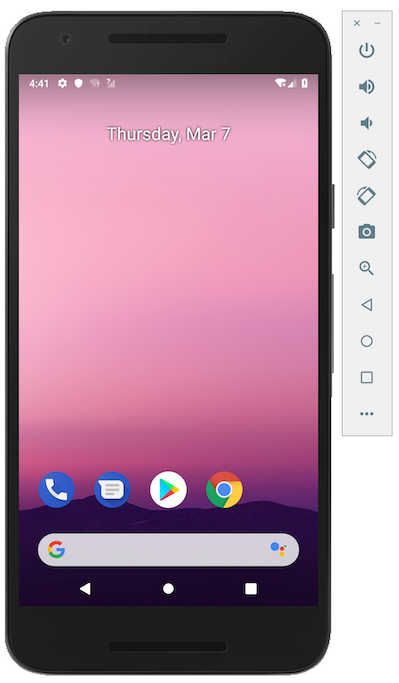

  

# 0.Get setup

###  Start your AEM instance

- Open your aem folder and start your instance by doubleclicking on the aem jar file or by using the terminal and this command line 

`java -jar aem-publish-p4503.jar -gui -debug 8080`

 

- Install your PWA sarter package this way :
Go to the [CRX Package Manager](http://localhost:4503/crx/packmgr/index.jsp) and upload [TL30 Progressive Web Application AEM package](/tools/starter.zip)

 

---

### Start your Android Emulator 

- Open the Android Studio Application from your Application folder 

  
 
- Click on the followings : Tools > Avd Manager - A new window will be opened as shown below

  
 
- Start the Nexus 5 Virtual Device

  
 
 - Check if your emulator is up an running 
 
   
---

### Setup Chrome Remote Debugging

- Open the Chrome Developer Tools by clicking on the F12 button 

- Click on the followings : Three vertical dots button on top right corner > More Tools > Remote Devices
 
- Enable port forwarding by clicking on Add Rule button then 4503 : localhost:4503

Go to the next chapter : [Progressive Web Application in a nutshell](chapter-1.md)

### Hands on activities

- As you know AEM uses a cookie based authentica