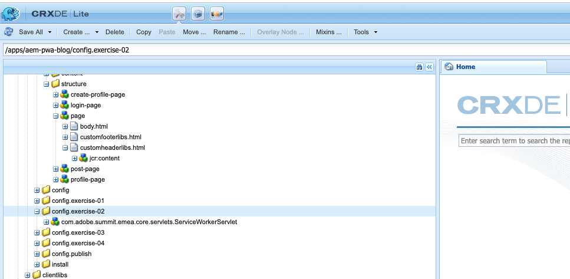
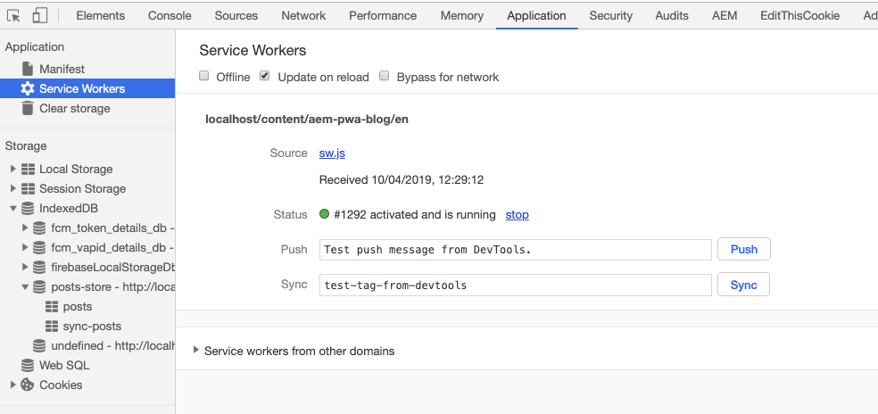

  

## 3. Add a service worker

### Purpose

- A service worker is a script that your browser runs in the background, separate from a web page, opening the door to features 
that don't need a web page or user interaction. .

### Hands on tasks

- Go back to your CRXDE :
  - open up this file 
`/apps/aem-pwa-blog/clientlibs/clientlib-site/scripts/main.js` and add the following code to register the service worker:


```
if ('serviceWorker' in navigator && 'PushManager' in window) {
    console.log('[TL30-PWA] >>>>> Service Worker and Push is supported');
    window.addEventListener('load', function() {
        navigator.serviceWorker.register('/content/aem-pwa-blog/sw.js',{ scope: '/content/aem-pwa-blog/en' })
            .then(function(registration) {
            // Registration was successful
            console.log('[TL30-PWA] >>>>> ServiceWorker registration successful with scope: ', registration.scope);
                swRegistration = registration;
                initializeUI();
        }, function(err) {
            // registration failed :(
            console.log('[TL30-PWA] >>>>> ServiceWorker registration failed: ', err);
        });
    });
}else {
    console.warn('Service workers and Push messaging are not supported.');
}
```


 - Copy the Service Worker servlet configuration from `/apps/aem-pwa-blog/config.exercise-02/com.adobe.summit.emea.core.servlets.ServiceWorkerServlet` 
 to `/apps/aem-pwa-blog/config`
 
  
 
 - Inspect the home page by pressing onto F12 , Go to the Application tab you will see
 
  
 

 AEM renders clientlibs from the following paths :
 
   - /etc/designs/_my_project_
   - /etc/clientlibs/_my_project_ 
   - /etc.clientlibs/_my_project_ 
   
 These paths are not at the root location of my blog : /content/aem-pwa-blog. As per [0] we need to put it at this /content/aem-pwa-blog/sw.js. 
 This is the reason why we have an OSGi servlet using HTTP Whiteboard pattern which loads the file from /etc/clientlibs/aem-pwa-blog/sw.js and display it at /content/aem-pwa-blog/sw.js.
 

 

### Go further

- [0] https://developer.mozilla.org/en-US/docs/Web/API/Service_Worker_API/Using_Service_Workers 
- https://jakearchibald.github.io/isserviceworkerready/#moar


Go to the next chapter : [Cache the app shell](chapter-4.md)